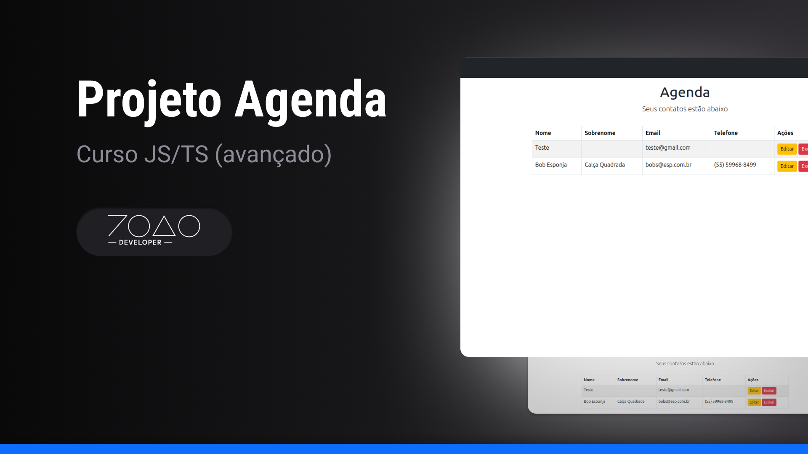

## 1. Introdução

O projeto **Agenda** é uma aplicação que permite aos usuários criar, editar e deletar seus contatos. Este projeto foi desenvolvido durante o curso de JavaScript/TypeScript avançado. Para mais informações sobre o curso, consulte o [repositório do curso completo](https://github.com/joaovic-tech/curso-js/).

---

## 2. Temas Estudados

Neste projeto, foram abordados os seguintes temas:

- Nginx
- PM2

---

## 3. Arquitetura do Projeto

A aplicação segue o padrão **MVC** (Model-View-Controller), que é uma arquitetura amplamente utilizada para o desenvolvimento de aplicações web.

- **M** - Model: Representa a estrutura de dados da aplicação.
- **V** - View: É a interface do usuário, onde as informações são apresentadas.
- **C** - Controller: Responsável por intermediar as interações entre o Model e a View.

---

## 4. Capturas de Tela

Abaixo estão algumas imagens que ilustram o funcionamento do projeto:

|             Projeto             | Servidor criado com PM2 e Nginx |
| :-----------------------------: | :-----------------------------: |
|  |      |

---

## 5. Gravação do Projeto

A seguir, uma gravação que demonstra o uso da aplicação:

---

## 6. Licença

Este projeto está sob a licença [GNU General Public License.](./LICENSE)
